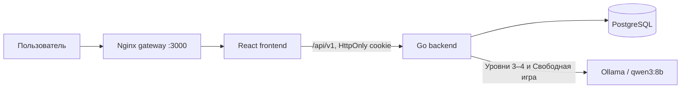

<div align="center">

# Safe Dialog Client

### Личный frontend-кейс: интерактивный тренажёр безопасного поведения в сделках

[](frontend/package.json)
[](frontend/package.json)
[](https://github.com/xternall99/safe-dialog-client/actions/workflows/frontend-quality.yml)

[Быстрый запуск](#быстрый-запуск) · [Frontend](#frontend-реализация) · [Путь пользователя](#путь-пользователя) · [Архитектура](#архитектура) · [Проверки](#проверки)

</div>

## О проекте

Мошенничество в объявлениях часто выглядит как обычная сделка: собеседник просит перейти по ссылке, назвать код из SMS, оплатить товар вне сервиса или продолжить разговор в стороннем мессенджере. Пользователь может помнить правила безопасности, но растеряться в конкретном диалоге.

**Safe Dialog Client** — моя frontend-часть командного проекта Anti-scam trainer. Пользователь выбирает роль покупателя или продавца, изучает короткую Теорию, закрепляет знания в Quiz и принимает решения в диалоговых Сценариях. После Прохождения он получает Result с разбором рисков, безопасных действий, Баллами и Звёздами.

> **Учебный проект.** Интерфейс демонстрирует продуктовую и инженерную реализацию тренажёра и не является сервисом Авито. Название и фирменные элементы используются только в рамках некоммерческого образовательного прототипа.

Главный фокус репозитория — архитектура React-приложения, интеграция с типизированным HTTP API, обработка серверного состояния, тестирование и доступный адаптивный интерфейс. Full-stack snapshot сохранён для воспроизводимого запуска и понимания контрактов, но мой персональный вклад сосредоточен в каталоге [`frontend`](frontend/).

## Frontend-реализация

- React 19 и TypeScript со строгими проверками;
- облегчённый Feature-Sliced Design и контролируемое направление зависимостей;
- RTK Query для запросов, кэширования и инвалидации серверных данных;
- Zod на границе API и преобразование DTO в доменные модели;
- React Hook Form для сложных административных форм;
- адаптивные SCSS Modules и базовая доступность с клавиатуры;
- unit/integration-тесты на Vitest, Testing Library и MSW;
- E2E-проверки пользовательских маршрутов в Playwright;
- Husky, lint-staged и GitHub Actions для автоматического контроля качества.

## Продуктовый контекст MVP

- регистрация и вход по Логину и паролю; JWT хранится в защищённой `HttpOnly` cookie;
- отдельные ролевые ветки покупателя и продавца;
- 6 Тем безопасности для каждой роли;
- пять упорядоченных блоков Теории и Quiz из пяти вопросов для каждой Темы;
- четыре последовательных Уровня с открытием следующего при результате от одной Звезды;
- диалоговые тренировки с готовыми вариантами, смешанным и свободным вводом;
- Свободная игра для обеих ролей; до завершения основных Уровней интерфейс показывает предупреждение о неполном обучении;
- Ежедневное задание «мошенник или нет» и Серия дней;
- Прогресс, Звёзды, Result, рекомендации следующего действия и Достижения;
- администраторский HTTP API для Тем, Теории, Quiz и Сценариев;
- web-админка для управления Темами и метаданными Сценариев через реальный backend;
- versioned OpenAPI, миграции PostgreSQL, Docker Compose и автоматические проверки.

### Как устроена тренировка

| Этап       | Что делает Пользователь                           | Что получает                                           |
| ---------- | ------------------------------------------------- | ------------------------------------------------------ |
| Теория     | Изучает пять коротких учебных блоков Темы         | Контекст и признаки риска перед практикой              |
| Quiz       | Отвечает на пять вопросов и набирает не менее 80% | Доступ к первому Уровню Темы                           |
| Уровни 1–2 | Выбирает готовые ответы в управляемом Сценарии    | Понятную практику базовых безопасных действий          |
| Уровень 3  | Комбинирует готовые ответы и свой текст           | Оценку ответа локальной моделью по рубрике Сценария    |
| Уровень 4  | Ведёт свободный диалог с виртуальным собеседником | Практику самостоятельного решения в сложной ситуации   |
| Result     | Изучает разбор каждого решения                    | Баллы, Звёзды, сигналы риска и безопасные альтернативы |

Свободная игра доступна для обеих ролей и предлагает сначала завершить основные Уровни выбранной ролевой ветки. В отличие от учебных Уровней, в ней заранее неизвестно, является ли виртуальный собеседник мошенником. Ежедневное задание предлагает определить риск по Снимку диалога и поддерживает Серию дней.

## Путь пользователя

1. Пользователь регистрируется и выбирает роль покупателя или продавца.
2. На главной странице видит рекомендуемое действие, Темы, Ежедневное задание и Свободную игру.
3. Читает Теорию выбранной Темы и проходит Quiz с порогом `80%`.
4. Проходит четыре Уровня диалоговой тренировки, получая до трёх Звёзд.
5. Изучает Result: решения по Шагам, замеченные сигналы риска и безопасные действия.
6. Следит за Прогрессом, Серией дней и Достижениями; после завершения ветки Свободная игра становится рекомендуемым следующим действием.

### Что уже можно показать на демо

- полный путь регистрации, обучения и сохранения Прогресса после повторного входа;
- 12 опубликованных Тем: по шесть для покупателя и продавца, 60 блоков Теории, 60 вопросов Quiz и 48 Сценариев;
- восстановление незавершённого Прохождения и неизменный Result после завершения;
- Dashboard с рекомендуемым следующим действием, Ежедневным заданием, Серией дней и Достижениями;
- админ-панель для управления Темами, Теорией, Quiz и доступными в API метаданными Сценариев;
- отдельный детерминированный демо-пользователь `demo-seller`, создаваемый командой `make demo-reset`.

## Технологии

| Область               | Технологии                                                               |
| --------------------- | ------------------------------------------------------------------------ |
| Frontend              | React 19, TypeScript, Vite, React Router                                 |
| Данные и формы        | Redux Toolkit, RTK Query, React Hook Form, Zod                           |
| UI                    | SCSS Modules, Phosphor Icons                                             |
| Frontend-тестирование | Vitest, Testing Library, MSW, Playwright                                 |
| Backend               | Go, `net/http`, модульный монолит                                        |
| Данные                | PostgreSQL 18, SQL-миграции и seed-контент                               |
| AI                    | локальная Ollama, `qwen3:8b`, ограниченный контекст и строгий JSON-ответ |
| Контракты             | OpenAPI 3.1, HTTP API `/api/v1`                                          |
| Инфраструктура        | Docker Compose, Nginx, Make                                              |
| Качество              | ESLint, Prettier, Husky, lint-staged, Go tests                           |

## Архитектура



Backend построен как **модульный монолит**: feature-модули разделяют transport, service и repository. Frontend использует облегчённый FSD-подход с однонаправленными зависимостями:

```text
app → pages → widgets → features → entities → shared
```

- **RTK Query** владеет серверным состоянием и кэшем HTTP API.
- DTO проверяются через **Zod** и преобразуются в camelCase-модели до попадания в UI.
- Срезы имеют публичные `index.ts`; глубокие импорты между срезами запрещены.
- Стили компонентов colocated в **SCSS Modules**.
- OpenAPI-файл является источником истины для HTTP-контрактов.
- Модель вызывается только backend: prompt получает ограниченный предметный контекст, а не всю историю продукта.

### Почему решение контролируемо

- Сценарии, рубрики и учебный контент хранятся отдельно от кода и публикуются только после проверки полноты пути обучения.
- Backend остаётся источником истины для открытия Уровней, подсчёта Баллов, Звёзд, Прогресса и выдачи Достижений.
- AI не получает секреты или клиентские токены: локальная Ollama вызывается только сервером, получает ограниченный контекст и возвращает строго проверяемый JSON.
- Если ответ модели недоступен или не проходит валидацию, система применяет безопасный fallback без частичной записи состояния.

Подробнее: [обзор архитектуры](docs/02-architecture/README.md) и [ADR](docs/02-architecture/adr/README.md).

## Структура проекта

```text
anti-scam-trainer/
├── backend/                       # Go API, доменная логика, миграции и OpenAPI
│   ├── cmd/api/                   # composition root приложения
│   ├── internal/core/             # общие доменные и инфраструктурные механизмы
│   ├── internal/features/         # auth, learning, attempts, scenarios
│   ├── internal/tests/            # контрактные и acceptance-тесты
│   ├── migrations/                # up/down SQL-миграции и seed-контент
│   └── openapi/v1/openapi.yaml    # источник истины HTTP API
├── frontend/                      # React-приложение и собственный toolchain
│   ├── src/app/                   # роутинг, store, providers и глобальные стили
│   ├── src/entities/              # пользователь, обучение, прогресс, admin-контент
│   ├── src/features/              # законченные пользовательские действия
│   ├── src/widgets/               # крупные составные блоки интерфейса
│   ├── src/pages/                 # пользовательские и административные страницы
│   ├── src/shared/                # независимые переиспользуемые срезы
│   └── e2e/                       # Playwright-сценарии
├── deploy/                        # Dockerfile, Compose и Nginx gateway
├── docs/                          # продуктовая, архитектурная и эксплуатационная база
├── CONTEXT.md                     # обязательный словарь предметной области
└── Makefile                       # единые команды разработки
```

## Быстрый запуск

### Требования

- Docker с поддержкой Compose;
- `make`;
- Go версии из [`backend/go.mod`](backend/go.mod);
- Node.js и npm для разработки frontend;
- свободные порты `3000`, `5432`, `8080`, а для локальной модели — `11434`.

### 1. Подготовка окружения

```bash
git clone git@github.com:xternall99/safe-dialog-client.git
cd safe-dialog-client
make setup
```

`make setup` создаёт локальные `.env` из примеров и устанавливает зависимости. Перед запуском заполните в `backend/.env` обязательные секреты:

```dotenv
JWT_SECRET=<случайный длинный секрет>
ADMIN_USERNAME=<логин администратора>
ADMIN_PASSWORD=<пароль администратора>
SWAGGER_USERNAME=<логин Swagger UI>
SWAGGER_PASSWORD=<пароль Swagger UI>
```

Секреты не должны попадать в Git. При старте backend автоматически создаёт единственную учётную запись администратора из `ADMIN_USERNAME` и `ADMIN_PASSWORD`.

### 2. Сборка frontend и контейнеров

```bash
cd frontend
VITE_API_BASE_URL=/api npm run build
cd ..

make build
make up
```

После запуска доступны:

| Сервис               | Адрес                                 |
| -------------------- | ------------------------------------- |
| Приложение и gateway | http://localhost:3000                 |
| Backend API          | http://localhost:8080                 |
| Health check         | http://localhost:8080/api/v1/health   |
| Swagger UI           | http://localhost:8080/swagger/        |
| OpenAPI v1           | http://localhost:8080/openapi/v1.yaml |

Swagger UI и OpenAPI защищены отдельными `SWAGGER_USERNAME` и `SWAGGER_PASSWORD`.

### 3. Запуск с локальной моделью

```bash
make start-ollama
```

`make start-ollama` собирает образы, запускает PostgreSQL, API, gateway и Ollama, затем загружает модель из `OLLAMA_MODEL`. Значение по умолчанию — `qwen3:8b`; первый запуск потребует времени и свободного места для модели.

Чтобы перед запуском полностью удалить локальные данные Пользователей, Прохождений и результатов, оставив после следующего старта только данные seed-миграций, выполните:

```bash
make db-reset
make start-ollama
```

`make db-reset` необратимо удаляет `out/pgdata` и останавливает сервисы. При следующем запуске миграции создадут схему и seed-контент заново; учётная запись администратора будет создана backend из `ADMIN_USERNAME` и `ADMIN_PASSWORD`.

### Frontend отдельно в dev-режиме

```bash
cd frontend
npm ci
npm run dev
```

Vite запускается на `http://localhost:5173`, а запросы отправляет на адрес из `VITE_API_BASE_URL`. Backend должен разрешать этот origin через `FRONTEND_ORIGINS`.

Чтобы посмотреть основной пользовательский путь без backend, откройте локальный preview-режим:

```text
http://localhost:5173/preview/login
```

Preview использует подготовленные данные только внутри frontend и не подменяет production-интеграцию.

### Остановка

```bash
make down

# Если запускали конфигурацию с Ollama
make down-ollama
```

Полная инструкция, переменные окружения и диагностика: [локальная разработка](docs/03-operations/local-development.md).

## Проверки

```bash
# Backend
cd backend
go test ./...

# Frontend: format check, lint, types, unit-тесты и production build
cd frontend
npm run check

# E2E frontend
npm run test:e2e
```

Из корня также доступны:

```bash
make lint
make test
```

## Особенности реализации

- **Безопасная аутентификация.** JWT передаётся через `HttpOnly` cookie; frontend не хранит токен в `localStorage`.
- **Один origin.** Nginx отдаёт приложение и проксирует `/api`, поэтому cookie одинаково работает локально и после развёртывания.
- **Управляемая прогрессия.** Backend является источником истины для открытия Уровней, Баллов, Звёзд и завершения Темы.
- **Контроль AI.** Для модели ограничены контекстное окно и резерв ответа; backend проверяет JSON и применяет fallback без частичной записи состояния. На Уровне 3 модель оценивает ответ, а на Уровне 4 и в Свободной игре раздельно работают Evaluator и Generator.
- **Редактируемый контент.** Темы, Теория, Quiz и Сценарии имеют lifecycle `draft → published → archived`.
- **Честная граница админки.** Web-панель полностью управляет Темами, Теорией и Quiz, а также метаданными и lifecycle Сценариев. Текущий backend не возвращает админскому клиенту сохранённый состав Шагов Сценария, поэтому их визуальное редактирование не имитируется на frontend.

## История разработки

Репозиторий сохраняет историю разработки в [коммитах](https://github.com/xternall99/safe-dialog-client/commits/main/) и pull request’ах. Основные этапы:

1. инфраструктура, первичная схема данных и CRUD-основа;
2. доменная модель Тем, Сценариев, Прохождений и Прогресса;
3. аутентификация, контентный API, миграции и seed-данные;
4. AI provider, Свободная игра, Ежедневное задание и rate limiting;
5. frontend-архитектура, пользовательский путь и интеграция с API;
6. админский интерфейс и подготовка командной документации.

## Авторство и командный контекст

Моя зона ответственности — frontend-архитектура, пользовательские и административные экраны, интеграция с API, клиентские контракты, SCSS Modules, тесты и дизайн-QA. Полное решение создавалось командой из четырёх человек:

| Участник                        | Ответственность                                                                                                                                                       |
| ------------------------------- | --------------------------------------------------------------------------------------------------------------------------------------------------------------------- |
| **Антон Загайнов** — `w0rn3zz`  | Backend и интеграция: доменная модель, PostgreSQL и миграции, HTTP API, аутентификация, AI provider, Docker-инфраструктура, техническая документация, review и merge. |
| **Илья Логинов** — `xternall99` | Frontend: архитектура React-приложения, пользовательские и административные экраны, RTK Query, API-контракты, SCSS Modules, тесты и дизайн-QA.                        |
| **Андрей Орлов** — `lopohlop`   | Начальная подготовка backend-части и CRUD-основы проекта.                                                                                                             |
| **Дмитрий Данилов** — `d1ma11`  | Подготовка контрактов и участие в проектировании базы данных.                                                                                                         |

Командный репозиторий: [Codiki-lab/anti-scam-trainer](https://github.com/Codiki-lab/anti-scam-trainer).

## Документация

- [Submission one-page](docs/submission/one-page.md)
- [Глоссарий предметной области](CONTEXT.md)
- [Карта документации](docs/README.md)
- [Текущее состояние продукта](docs/01-current-state/README.md)
- [Описание продукта](docs/01-current-state/product.md)
- [Игровой дизайн](docs/01-current-state/game-design.md)
- [Архитектура](docs/02-architecture/README.md)
- [Архитектурные решения](docs/02-architecture/adr/README.md)
- [Frontend API-контракты](docs/08-frontend-api-contracts/current-http-api.md)
- [Локальная разработка](docs/03-operations/local-development.md)
