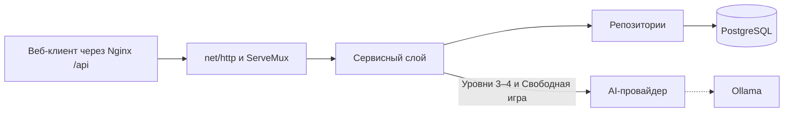

# Архитектура

## Общая схема

Проект развивается как монолитное приложение. В `backend/internal` код разделён на `core` с общими модулями, `features` с продуктовыми возможностями и `tests` с проверками. Внутри каждой продуктовой возможности HTTP-обработчики вызывают сервисы, сервисы обращаются к репозиториям, а репозитории работают с PostgreSQL через `go-pg`.

Технический AI provider создаётся в composition root и передаётся сервису Прохождений через локальный порт. Сервис формирует ограниченный контекст и валидирует предметный JSON, а provider отвечает за Ollama и бюджет окна. Его контракт описан в [отдельном документе](ai-provider.md).

Продуктовый модуль `learning` обслуживает Темы, административный lifecycle учебного контента, Теорию, Quiz, Dashboard, Задание дня, Прогресс, Серию дней и чтение Достижений. Завершение Прохождения остаётся в `attempts`: локальный транзакционный порт одной операцией сохраняет последний Ответ пользователя, историю, статус, лучший Прогресс, Result, выполнение Задания дня, активность дня и новые Достижения.

Общий технический пакет `core/ratelimit` содержит bounded in-memory limiter, определение client IP за настроенными trusted proxies и gate одной активной AI-генерации на Пользователя. Состояние квот намеренно локально одному процессу MVP и сбрасывается при рестарте.

## Компоненты

### Frontend composition root

`frontend/src/app/App.tsx` только запускает клиентский роутер. Декларативная
таблица production- и preview-маршрутов находится в `app/router/AppRouter.tsx`,
проверки доступа и ленивое подключение админки — в `app/router/RouteGuards.tsx`,
а layouts авторизованного и preview-приложения — в
`app/router/AppLayouts.tsx`. Адаптеры, связывающие preview fixtures с обычными
страницами, принадлежат `app/preview`.

Такое разделение сохраняет все продуктовые маршруты в одном обозримом месте,
но не смешивает их с загрузкой Account, проверкой прав, layout и демонстрационным
источником данных. Данные backend проходят границу RTK Query → Zod → mapper до
попадания в UI. Административные endpoint-группы разделены по агрегатам Темы и
Сценарии, сохраняя общий публичный API slice `entities/admin-content`.

### Точка входа

`backend/cmd/api/main.go` создаёт приложение через `core/app.New`, запускает HTTP-сервер и закрывает соединение с БД при остановке.

### Сборка приложения

`backend/internal/core/app` является узким composition root и отвечает за:

- чтение переменных окружения;
- создание подключения к PostgreSQL;
- связывание PostgreSQL-реализаций репозиториев с сервисами и HTTP-обработчиками;
- создание AI provider из конфигурации и адаптация к локальному порту сервиса Прохождений;
- регистрацию маршрутов продуктовых возможностей в версионном роутере.

HTTP-обработчики и SQL-запросы в нём не размещаются. Жизненным циклом `http.Server` управляет `core/server/runtime`; `main.go` только запускает и закрывает собранное приложение.

### HTTP-слой

Общий HTTP-код находится в `core/server`: `runtime` управляет жизненным циклом `http.Server`, `router` добавляет версию API, `middleware` содержит общую цепочку, а `request` и `response` отвечают за общие HTTP-детали. В каждом продуктовом модуле есть `transport/http` с обработчиком и собственными request/response DTO. Обработчик получает конкретный сервис, а не дублирующий интерфейс. DTO преобразуются в доменные типы до вызова сервиса.

### Сервисы

Сервис каждого модуля определяет и использует малый интерфейс своего репозитория. Общие модули находятся в `internal/core`: предметные правила — в `domain`, а технические адаптеры — в `aiprovider`, `config`, `logger`, `postgres`, `errors` и `server`. Например, допустимые переходы статуса прохождения и расчёт звёзд по баллу остаются чистыми правилами в `internal/core/domain`.

### Репозитории

PostgreSQL-репозитории находятся в `features/<feature>/repository`. Они используют общий адаптер подключения `internal/core/postgres`, `go-pg` и закрытые модели хранения, преобразуя их в доменные типы. Для сценария завершения прохождения PostgreSQL-адаптер выполняет обновление прохождения и прогресса в одной транзакции через локальный порт сервиса `attempts`.

### Тесты

Проверки расположены в `backend/internal/tests` и сгруппированы по проверяемому модулю или контракту. Они используют публичные интерфейсы модулей: так тестовая поверхность совпадает с тем, что доступно вызывающему коду.

### HTTP middleware

Перед роутером подключается единая цепочка `RequestID → Logger → Panic → Trace`. Она принимает или создаёт заголовок `X-Request-ID`, добавляет Zap-логгер в контекст запроса, преобразует непойманную панику в `500 Internal Server Error` и записывает начало и завершение HTTP-запроса с кодом ответа и задержкой. Записи поступают в stdout и файл в `LOG_FOLDER`; уровень задаётся переменной `LOG_LEVEL`, по умолчанию — `debug`.

### Хранилище

Основное хранилище — PostgreSQL. Текущая и целевая предметная модель описаны отдельно в [модели данных](data-model.md).

## Технологии

| Зона | Технология | Фактическое использование |
| --- | --- | --- |
| Бэкенд | Go 1.26.5 | Версия объявлена в `backend/go.mod` |
| HTTP | `net/http` | Сервер и маршрутизация |
| Доступ к данным | `github.com/go-pg/pg` v8 | CRUD-репозитории |
| База данных | PostgreSQL 18.1 | Контейнер в основном Compose-файле |
| Миграции | `migrate/migrate` 4.19.1 | Одноразовый контейнер применяет versioned-миграции перед запуском API в Compose |
| Локальная модель | Ollama 0.32.6 | Контейнер, загрузка модели и технический provider для `POST /api/chat` |
| Оркестрация | Docker Compose, Make | Локальная инфраструктура и команды разработчика |
| Прокси | Nginx | Конфигурация пока пустая |
| Фронтенд | React 19, TypeScript, Vite, RTK Query | Light FSD-клиент в `frontend/`, API boundary проверяется Zod |

## Архитектурные решения

- [ADR-0001: монолит и трёхслойный бэкенд](adr/0001-monolith-and-three-layers.md)
- [ADR-0002: локальная генеративная модель через Ollama](adr/0002-local-ai-through-ollama.md)
- [ADR-0003: четыре уровня и отдельная свободная игра](adr/0003-four-levels-and-free-play.md)
- [ADR-0004: продуктовые модули внутри трёхслойного бэкенда](adr/0004-feature-oriented-three-layer-backend.md)
- [ADR-0005: контейнеры core, features и tests](adr/0005-core-features-tests-layout.md)
- [ADR-0006: core/server и версионированные HTTP-маршруты](adr/0006-core-server-and-versioned-routes.md)
- [ADR-0007: трёхслойные продуктовые модули и локальные порты](adr/0007-feature-layers-and-local-ports.md)
- [ADR-0008: атомарное завершение прохождения и обновление прогресса](adr/0008-atomic-attempt-completion.md)
- [ADR-0011: разовая несовместимая замена API v1](adr/0011-one-time-v1-replacement.md)
- [ADR-0012: единый шаблон продуктовой возможности](adr/0012-uniform-feature-layout.md)
- [ADR-0013: frontend slices, state ownership и API boundary](adr/0013-frontend-slices-state-and-api-boundaries.md)

Не каждое обсуждение становится ADR. Запись нужна, если решение заметно ограничивает устройство системы и важно понимать, почему выбран именно этот вариант.
