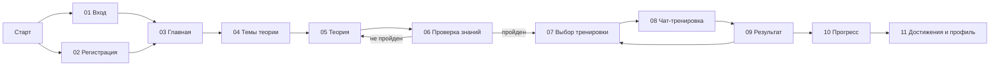
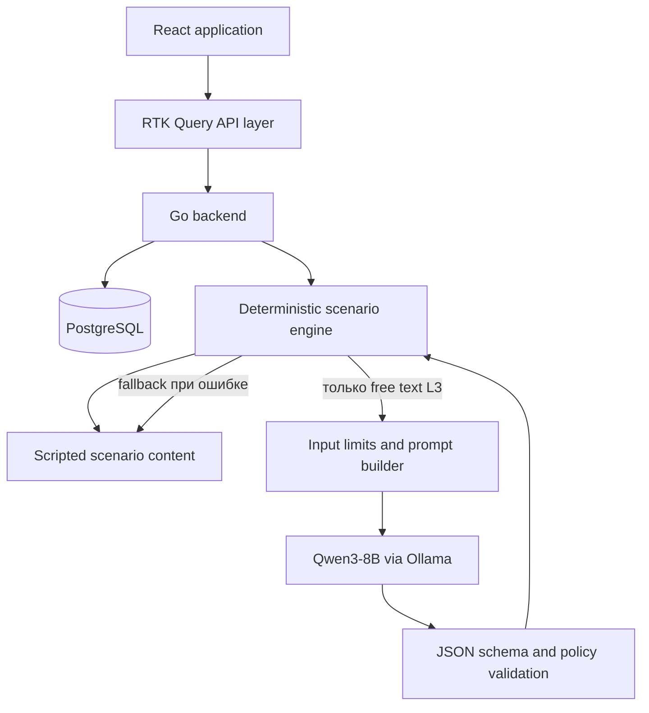
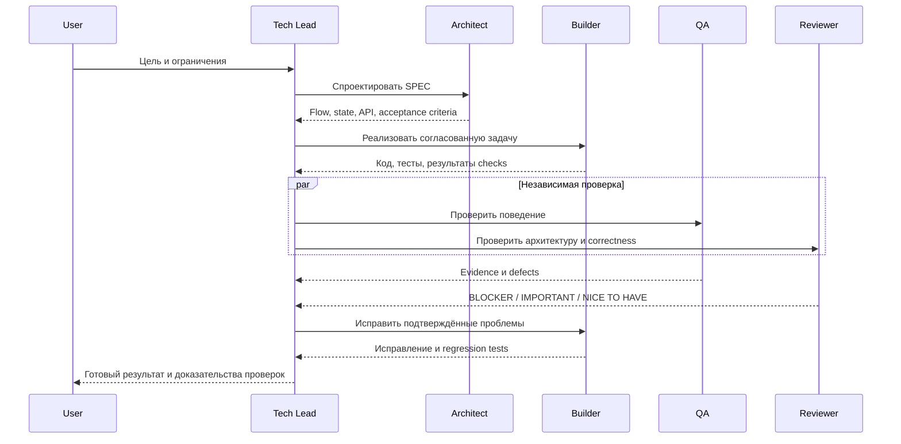

# Avito Anti-Scam Trainer — архитектура проекта

> Статус: базовая архитектура MVP
> Дата фиксации: 2026-08-09
> Область документа: продукт, frontend, граница с backend, AI-runtime и agent-assisted development

## 1. Архитектура в одном абзаце

Anti-Scam Trainer — модульный монолит с React-клиентом, Go-backend, PostgreSQL и локальным Qwen3-8B через Ollama. Основной пользовательский сценарий и scoring детерминированы backend-ом. Qwen применяется только там, где без него нельзя оценить свободный текст, и никогда не управляет состоянием сессии или итоговым результатом. Frontend строится как прагматичный light FSD, получает server state через RTK Query и не дублирует решения backend-а. Разработка управляется главным Codex Tech Lead: отдельные агенты проектируют, реализуют, тестируют и независимо ревьюят изменения, а автоматические quality gates не позволяют объявить задачу готовой при падающих проверках.

## 2. Главные архитектурные принципы

1. Сначала рабочий vertical slice, затем расширение.
2. Backend — единственный источник истины для сессии, scoring, прогресса и достижений.
3. L1 и L2 полностью детерминированы; L3 использует Qwen только как evaluator свободного текста.
4. Ни один невалидный ответ модели не показывается пользователю.
5. Frontend не придумывает поля API и не вычисляет бизнесовый результат самостоятельно.
6. Код размещается рядом с владельцем поведения; вынос в `shared` происходит только после появления стабильной общей абстракции.
7. FSD-зависимости направлены вниз, публичные контракты slices проходят через Public API.
8. Server state, form state, URL state и local UI state не смешиваются.
9. Один coding agent одновременно пишет в общий worktree; исследование и review можно выполнять параллельно.
10. Задача считается готовой только после релевантных lint, typecheck, tests и build.

## 3. Пользовательский контур



### Экраны MVP

| Экран | Назначение |
|---|---|
| 01 Вход / Login | Вход существующего пользователя |
| 02 Регистрация / Registration | Создание пользователя и выбор роли |
| 03 Главная / Dashboard | Продолжение обучения, темы, рекомендации и серия дней |
| 04 Темы теории / Lessons | Шесть тем выбранной роли и их состояние |
| 05 Теория / Theory | Учебный материал по конкретному риску |
| 06 Проверка знаний / Quiz | Короткая проверка понимания теории |
| 07 Выбор тренировки / Training | Сценарии по теме, роли и сложности |
| 08 Чат-тренировка / Chat Training | Симуляция переписки в стиле Avito Messenger |
| 09 Результат / Result | Score, ошибки, сигналы риска и безопасные действия |
| 10 Прогресс / Progress | История и статистика обучения |
| 11 Достижения и профиль / Achievements Profile | Профиль, роль, серия дней и достижения |

Контекст товара и краткое описание сценария показываются внутри экрана выбора тренировки или перед запуском в диалоге. Отдельный двенадцатый экран Scenario Preview для MVP не требуется.

### Маршруты frontend

```text
/login
/register
/dashboard
/lessons
/lessons/:lessonId
/lessons/:lessonId/quiz
/chats
/sessions/:sessionId
/sessions/:sessionId/result
/progress
/achievements
/preview
/preview/<same-screen-paths>
```

### Состояние реализации frontend foundation

На ветке `feat/frontend-foundation` создан самостоятельный Vite-клиент в
`frontend/`. Он содержит адаптивные UI-маршруты всех 11 экранов, общий
авторизованный layout, переключатель ролевой ветки и индикатор серии дней.

Второй этап foundation вынес продуктовые обязанности из компонентов страниц.
`pages` только собирают отдельные route-экраны, `widgets` отображают
самостоятельные блоки, `features` оркестрируют пользовательские действия, а
`entities` владеют DTO, внутренними camelCase-моделями, mapper-функциями и RTK
Query endpoints. Каждый slice разделён на фактически необходимые сегменты
`api`, `model`, `lib`, `ui`; пустые сегменты не создаются. Внешние слои
используют только `index.ts` слайсов, а архитектурные правила ESLint запрещают
обратные зависимости и deep imports.

OpenAPI DTO не передаются напрямую в представление. На границе `entities`
они преобразуются в устойчивые модели frontend. Поэтому изменение snake_case
полей backend локализовано в contracts и mappers. Смена роли сохраняется через
`/api/v1/profile/preferences`, а возвращённый Account обновляет RTK Query cache.

Роль пользователя имеет один runtime-источник — `Account`, полученный из
`GET /auth/me`. `CurrentAccountProvider` передаёт в нижние слои узкий контракт
чтения аккаунта и смены роли. Роль не копируется в Redux или localStorage.
RTK Query хранит только server state, React Hook Form — состояние форм,
React Router — выбранную Тему и идентификаторы маршрутов, локальный `useState`
— только состояние конкретного UI.

Для дизайн-ревью без поднятого backend добавлен отдельный data source в
`app/preview`: `PreviewModeProvider` переключает hooks на типизированные
preview-модели, которые внедряются уровнем приложения.
`/preview` открывает все 11 экранов без сетевых запросов, включая вход, чат,
результат, прогресс и достижения. Обычные маршруты остаются авторизованными и
работают только через API.

- регистрация, вход, получение текущей учётной записи и выход используют
  текущие маршруты `/api/v1/auth/*` с `credentials: include`;
- Темы, теория, Quiz, Уровни, Прохождение, результат, dashboard, прогресс и
  достижения используют маршруты актуального `backend/openapi/v1/openapi.yaml`;
- восстановление Прохождения выполняется по `attempt_id`, а конфликт
  `STALE_STEP` приводит к повторному чтению серверного состояния;
- `shared/http-client` содержит только общий transport и RTK Query cache;
  продуктовые endpoints и преобразование DTO принадлежат своим `entities`;
- `shared` состоит из независимых slices (`http-client`, `http-error`,
  `runtime-mode`, `error-state`, `brand`, `stars`, `url`), внутри которых
  используются нужные `model`, `lib`, `ui` и локальные тесты.

Проверки foundation: `npm run format:check`, `npm run lint`,
`npm run typecheck`, `npm run test`, `npm run build` и `npm run test:e2e` из
`frontend/`. Mapper-функции и transport contracts покрыты unit-тестами,
регистрация — React Testing Library и `user-event`, API boundary — MSW,
ключевой preview-flow — Playwright в Chromium.

Маршруты являются frontend-решением. Фактически реализованный HTTP-контракт фиксируется в `backend/openapi/v1/openapi.yaml`, а целевой контракт 11 экранов и связь дизайна с backend описаны в `docs/frontend-backend-integration.md`.

## 4. Runtime-архитектура



### Разделение ответственности

| Компонент | Владелец решений |
|---|---|
| Переходы сценария | Backend state machine |
| Текущий шаг сессии | Backend |
| Правильность scripted choices | Backend по `option_id` |
| Оценка free text | Qwen evaluator + backend validation |
| Итоговый score | Backend |
| Достижения и прогресс | Backend |
| Отображение и пользовательский ввод | Frontend |
| Loading, retry и локальное UI-состояние | Frontend |

## 5. Frontend-архитектура

### Технологии

- React 19
- TypeScript
- Vite
- React Router
- Redux Toolkit только для настоящего global client state
- RTK Query для server state
- React Hook Form для форм
- Zod для runtime validation на внешних границах
- Sass и SCSS Modules: стили расположены рядом с владельцем UI; глобально
  остаются только design tokens, reset и базовые HTML-правила
- Vitest, React Testing Library, `user-event`, MSW
- Playwright для ключевого E2E

### Light FSD

```text
frontend/src/
├── app/
│   ├── providers/
│   ├── preview/
│   ├── App.tsx
│   ├── App.module.scss
│   ├── store.ts
│   └── styles/
├── pages/
├── widgets/
├── features/
├── entities/
└── shared/
    ├── http-client/{model,index.ts}
    ├── http-error/{model,lib,index.ts}
    ├── runtime-mode/{model,ui,index.ts}
    ├── error-state/{ui,index.ts}
    ├── ui-kit/{ui,index.ts}
    └── brand|stars|url/{ui|lib,index.ts}
```

Каждый визуальный slice хранит собственный `*.module.scss` внутри сегмента
`ui`. Общие примитивы (`primaryButton`, `formError`, `pageHeading`) экспортирует
`shared/ui-kit`; экранные и предметные стили не выносятся в него. Поэтому стили
не образуют второй глобальный API и меняются вместе со своим компонентом.

Допустимые зависимости:

```text
app → pages → widgets → features → entities → shared
```

Нижний слой не импортирует верхний. Независимые features связываются в `page`, `widget` или `app`, а не через импорт внутренних файлов друг друга.

### Предполагаемые бизнесовые владельцы

Не все перечисленные slices обязаны появиться сразу. Slice создаётся только при наличии поведения или переиспользования.

```text
entities/
├── user/
├── lesson/
├── chat/
├── training-session/
└── achievement/

features/
├── auth/
├── submit-quiz/
├── filter-chats/
├── start-training-session/
├── answer-training-step/
└── complete-training-session/
```

Сложный связный `training-session` допустимо оставить одной крупной feature, если искусственное дробление увеличивает coupling.

### State ownership

| Вид состояния | Механизм | Примеры |
|---|---|---|
| Server state | RTK Query | уроки, сессия, прогресс, достижения |
| Form state | React Hook Form | login, register, free-text answer |
| Runtime validation | Zod | auth response, evaluator payload, нестабильные API-границы |
| URL state | React Router | выбранный lesson/chat/session |
| Local UI state | `useState` / `useReducer` | модалка, вкладка, раскрытый блок |
| Global client state | Redux Toolkit только при доказанной необходимости | сейчас отдельного client slice нет |

Данные RTK Query не копируются в обычный Redux slice без отдельного архитектурного решения.

## 6. API-граница

Источник текущего контракта — `backend/openapi/v1/openapi.yaml`. Реализованные пользовательские маршруты используют префикс `/api/v1`:

- `POST /auth/register`
- `POST /auth/login`
- `POST /auth/logout`
- `GET /auth/me`
- `PATCH /profile/preferences`
- `GET /dashboard`, `/topics`, `/progress`, `/achievements`
- `GET /topics/{id}/theory`, `GET /topics/{id}/quiz`
- `POST /topics/{id}/theory/read`, `POST /topics/{id}/quiz/attempts`
- `GET /training/levels?role=buyer|seller&topic_id=...`
- `POST /training/levels/{level}/start?role=buyer|seller&topic_id=...`
- `POST /training/free-play/start?role=buyer|seller`
- `GET /attempts/{id}`, `GET /attempts/{id}/result`
- `POST /attempts/{id}/answers`
- `POST /attempts/{id}/abandon`

Контракт 11 экранов реализован Темами, Теорией, Quiz, Прогрессом, Достижениями и Серией дней. Полный frontend handoff находится в `docs/frontend-backend-integration.md`.

### Основные типы

```text
UserRole = buyer | seller
Difficulty = easy | medium | hard
ResponseType = multiple_choice | similar_choice | mixed | free_text
AttemptStatus = IN_PROGRESS | COMPLETED | ABANDONED
```

На внешней границе неизвестное enum-значение должно приводить к безопасной ошибке или fallback-отображению, а не к падению приложения.

### Границы, которые frontend не додумывает

1. Доступность Тем и Уровней, Балл, Звёзды, Достижения и `continue_action` вычисляет backend.
2. Опубликованный Сценарий уникален для пары Тема–Уровень.
3. GameState возвращает product context, видимую реплику и историю, но не раскрывает внутренние инструкции и правильность ответа.
4. qwen3:8b вызывается только через backend; ошибку AI можно повторить без побочных эффектов.
5. OpenAPI гарантирует шесть Тем на роль и четыре Уровня на Тему; frontend не
   создаёт дополнительные Темы или Уровни локально.
6. Регистрация создаёт аккаунт без автоматического входа; после неё frontend
   переводит пользователя на `/login?registered=1`.
7. `daily_task` в Dashboard по текущему контракту всегда `null`; отдельное
   поведение задания дня не реализуется до изменения OpenAPI.
8. `product_context` является открытым объектом данных Сценария; frontend не
   предполагает обязательные поля без отдельной схемы.
9. Число Шагов сценария является данными и не хардкодится frontend.

## 7. AI-архитектура и защита от галлюцинаций

Подробный бюджет находится в `docs/scripted-chat-scenarios.md`. Базовые ограничения:

- рабочее окно Qwen: `num_ctx=8192`;
- целевой input: не более 3300 токенов;
- scammer output: до 120 токенов;
- evaluator output: до 240 токенов;
- жёсткая проверка: `input + maxOutput <= 0.75 × num_ctx`;
- полные документы, обе роли и все сценарии никогда не передаются в один prompt;
- L3: не более двух free-text точек;
- L4 и Свободная игра входят в реализованный MVP и используют четыре управляемые AI-фазы либо до пяти свободных Ответов пользователя;
- structured output проходит schema и policy validation;
- при ошибке модели состояние не меняется и запрос можно повторить; Сценарий хранит безопасную fallback-реплику.

Продуктовая гарантия формулируется так:

> Ни один невалидный, вышедший за сценарий или не прошедший policy-проверку ответ модели не показывается пользователю.

## 8. Архитектура разработки с coding agents

### Правило четырёх уровней

```text
AGENTS.md          → постоянные обязательные правила
.codex/agents/     → кто выполняет работу
.agents/skills/    → как выполняется повторяемый процесс
docs/              → что является фактом о проекте
```

`AGENTS.md` должен быть коротким. Подробные знания остаются в `docs`, а skills подгружаются только для подходящей задачи.

### Agent roles

```text
.codex/agents/
├── frontend-architect.toml
├── frontend-builder.toml
├── qa-engineer.toml
├── frontend-reviewer.toml
└── security-reviewer.toml
```

| Агент | Рекомендуемый режим | Ответственность |
|---|---|---|
| Главный Tech Lead | GPT-5.6 Sol High | Жизненный цикл задачи и итоговый статус |
| Frontend Architect | Sol High, read-only | SPEC, flow, state, API, FSD, риски |
| Frontend Builder | Sol Medium, workspace-write | Код и тесты задачи |
| QA Engineer | Terra High; запись только после builder | Reproduction, browser QA, regression, E2E |
| Frontend Reviewer | Sol High, read-only | Независимый correctness/FSD/TS/API review |
| Security Reviewer | Sol High, read-only | Auth, XSS, secrets, dependencies, AI security |

Главный агент не заменяется субагентами: он собирает выводы, разрешает противоречия и отвечает за финальную проверку.

### Project skills

```text
.agents/skills/
├── avito-deliver-feature/
├── avito-diagnose-bug/
├── avito-review-fsd/
├── avito-review-react-typescript/
├── avito-review-security/
└── avito-pre-submit-audit/
```

| Skill | Что объединяет |
|---|---|
| `avito-deliver-feature` | requirements → SPEC → tickets → implementation → review → handoff |
| `avito-diagnose-bug` | reproduce → root cause → fix → regression test |
| `avito-review-fsd` | FSD, ownership, Public API, dependencies, state ownership |
| `avito-review-react-typescript` | React, hooks, forms, TypeScript, accessibility, UI states |
| `avito-review-security` | Web, secrets, supply chain и AI guardrails |
| `avito-pre-submit-audit` | требования, tests, build, Docker, security, README, AI transparency |

Идеи Matt Pocock Skills, ECC, Oh My Codex и Anthropic Cybersecurity Skills используются как исходные checklists. Эти большие наборы не являются обязательными runtime-зависимостями и не устанавливаются целиком.

## 9. Workflow агентов

### Обычная feature



### Правила исполнения

- Маленькая правка не требует полного multi-agent pipeline.
- Один agent пишет код; параллельные agents преимущественно читают и проверяют.
- QA может добавлять тесты только после завершения этапа builder.
- `BLOCKER` запрещает финальный статус «готово».
- Неустранимое противоречие требований возвращается пользователю как конкретный вопрос.
- После крупного решения создаётся ADR.
- После существенного бага создаётся regression test.

## 10. Quality gates

Локальная защита коммитов подключена через Husky. Хук `pre-commit` запускает
`lint-staged` из `frontend/` и проверяет только добавленные в коммит файлы
`src/**/*.{ts,tsx}` командой ESLint. Это быстрый фильтр ошибок, а не замена
полных проверок ниже.

Для существенных frontend-изменений:

```text
npm run lint
npm run typecheck
npm run test
npm run build
npm run format:check
npm run test:e2e
```

Перед сдачей добавляются:

- backend tests;
- Docker Compose smoke test;
- secret scanning;
- dependency и container scanning;
- проверка security headers;
- проверка README и прозрачности использования AI.

Пока команды или соответствующие конфигурации ещё не существуют, агент обязан честно указать `not configured`, а не считать gate пройденным.

## 11. Источники истины

При конфликте проектной информации используется следующий приоритет:

1. Актуальные требования хакатона и явно поставленная задача.
2. Принятые ADR.
3. Актуальный API-контракт.
4. Проверенный работающий код и тесты.
5. Product/context/spec документы.
6. Старые чаты и исторические AI-ответы.

`AGENTS.md` определяет процесс работы, но не подменяет продуктовые факты и API-контракт.

## 12. Headroom и экономия контекста

Headroom не является частью приложения и не добавляется в production dependencies. Он может тестироваться позднее как локальный прокси для Codex CLI в отдельном профиле.

До подтверждённого теста экономия достигается средствами архитектуры:

- короткий `AGENTS.md`;
- progressive disclosure skills;
- точечное чтение файлов;
- компактные результаты субагентов;
- handoff между длинными задачами;
- отсутствие повторов между `AGENTS.md`, skills и `docs`.

Headroom не включается постоянно в Codex Desktop до подтверждения стабильной маршрутизации, качества и фактической экономии на одинаковых задачах.

## 13. Порядок реализации

1. Зафиксировать этот документ и backend API-контракт.
2. Создать короткий `AGENTS.md`.
3. Создать `.codex/agents` и шесть project skills.
4. Спроектировать frontend routes, API types и app shell.
5. Собрать один vertical slice: login/mock user → scenario → session → answer → result → progress.
6. Подключить реальный backend-контракт.
7. Довести остальные lessons, scenarios и achievements.
8. Провести browser QA, security review и pre-submit audit.

## 14. Внешние справочные материалы

- [OpenAI Docs: AGENTS.md](https://learn.chatgpt.com/docs/agent-configuration/agents-md)
- [OpenAI Docs: Subagents](https://learn.chatgpt.com/docs/agent-configuration/subagents)
- [OpenAI Docs: Build skills](https://learn.chatgpt.com/docs/build-skills)
- [Headroom](https://github.com/headroomlabs-ai/headroom)
